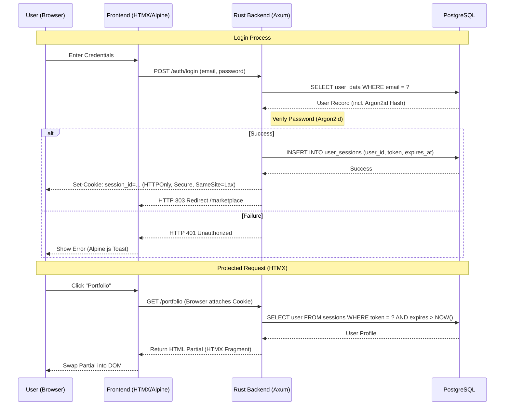

# Authentication & Session Flow

This document details the secure authentication mechanism used by the POOOL platform.

## Security Features
1. **Password Hashing**: Argon2id is used for all password storage, providing resistance against GPU/ASIC cracking.
2. **Session Security**:
   - `HttpOnly`: Prevents Cross-Site Scripting (XSS) from stealing session tokens.
   - `Secure`: Ensures cookies are only sent over HTTPS.
   - `SameSite=Lax`: Protects against Cross-Site Request Forgery (CSRF).
3. **Session Revocation**: Admins can immediately invalidate all active sessions for a specific user ID.
