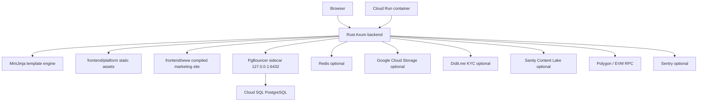
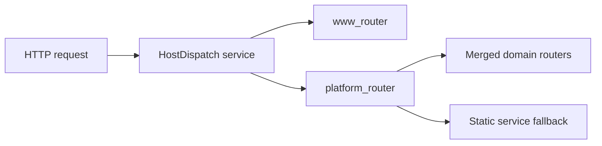
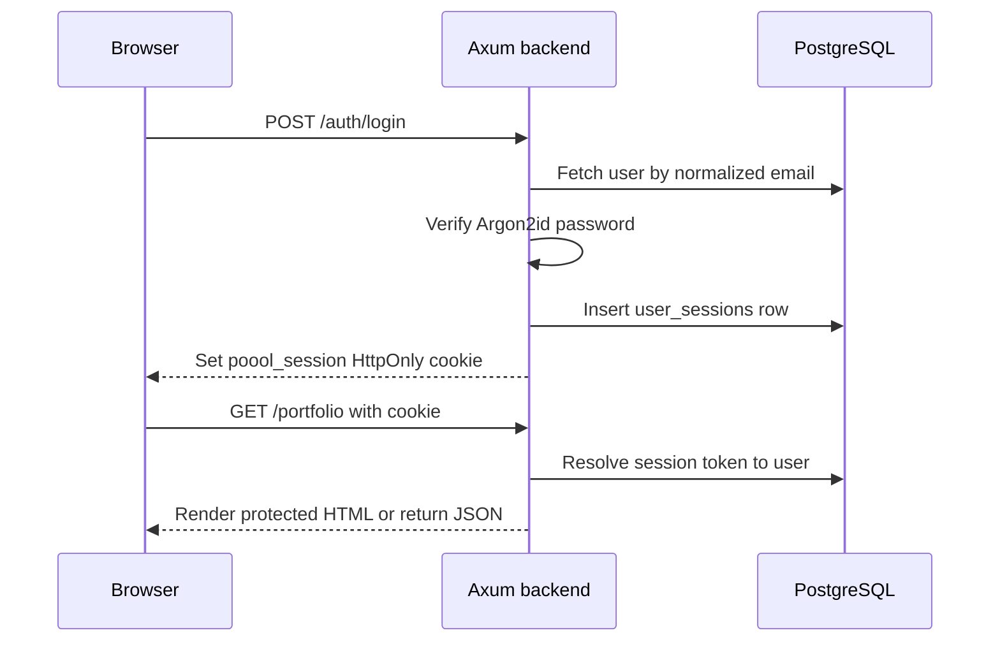
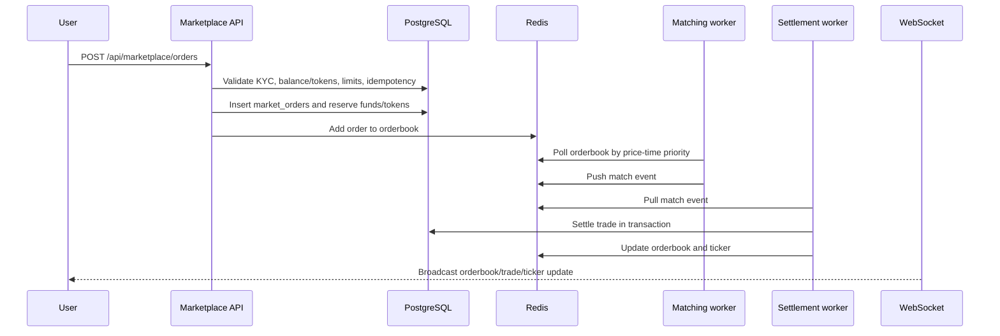
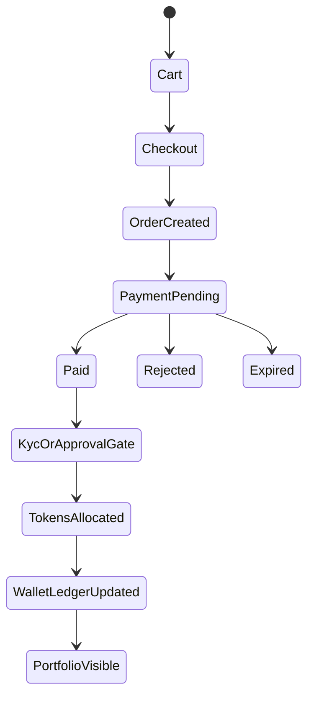
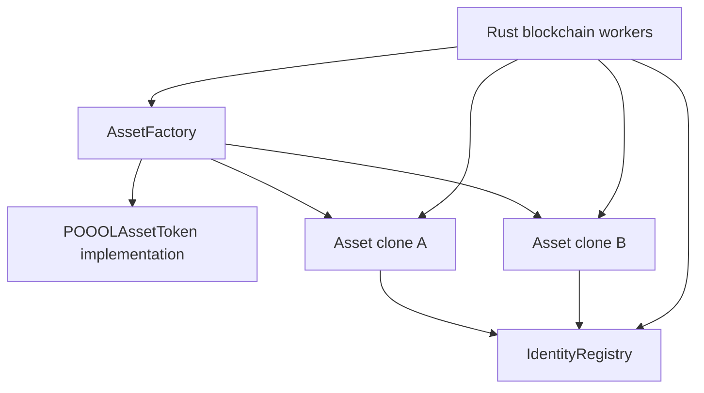

# POOOL Codebase And Architecture Documentation

Last updated: 2026-05-10

This document describes the current POOOL repository structure, runtime architecture, core domains, data flow, deployment model, and development workflow. It is intended as the first technical orientation document for engineers and agents working in this codebase.

Source of truth note: this file was written from the repository source, especially `AGENTS.md`, `backend/src/main.rs`, `backend/src/db.rs`, `backend/src/config.rs`, `backend/Cargo.toml`, `Dockerfile`, `backend/pgbouncer/entrypoint.sh`, `frontend/platform/`, `database/`, `contracts/`, and the existing docs in `docs/`.

## 1. Platform Summary

POOOL is a fractional ownership and real-world asset investment platform. The platform combines:

- A Rust/Axum backend that owns authentication, routing, business logic, database writes, background workers, and financial integrity.
- Server-rendered platform pages using MiniJinja templates loaded from `frontend/platform/`.
- Vanilla CSS and JavaScript for investor, developer, affiliate, admin, marketplace, and community UI.
- PostgreSQL as the system of record.
- Optional Redis for marketplace orderbook, WebSocket fanout, rate-limit support, and read-your-writes flags.
- Optional Google Cloud Storage for uploads.
- Optional Didit.me KYC integration with manual-review fallback.
- Optional Sanity Content Lake for public blog content and admin blog management.
- Solidity contracts for tokenized assets, deployed and managed via Foundry and backend blockchain workers.

The product has financial consequences. All money must be represented as integer cents, critical writes must be transactional, and the backend is the authority for every business rule.

## 2. Repository Map

```text
poool/
+-- AGENTS.md                         # Agent and developer operating rules
+-- README.md                         # Short project overview
+-- Dockerfile                        # Production container build and PgBouncer sidecar runtime
+-- backend/
|   +-- Cargo.toml                    # Rust dependencies and profiles
|   +-- pgbouncer/                    # Runtime PgBouncer config generator and template
|   +-- src/                          # Axum backend and domain modules
|   +-- templates/                    # Legacy auth templates; main loader uses frontend/platform
+-- contracts/                        # Foundry Solidity contracts and tests
+-- database/                         # Core SQL migrations
|   +-- community/                    # Community feature migrations
+-- docs/                             # Architecture, design, security, finance, ops, planning docs
+-- frontend/
|   +-- platform/                     # Platform HTML templates, CSS, JS, images
|   +-- www/                          # Compiled marketing static site for en/id
+-- scripts/                          # Utility, migration, audit, asset, and workflow scripts
+-- studio/                           # Sanity Studio project and schema
+-- tests/                            # Python static, integration, and E2E tests
```

Approximate current codebase size:

| Area | Count |
| --- | ---: |
| Rust source files under `backend/src` | 162 |
| Platform HTML files under `frontend/platform` | 201 |
| Platform CSS files under `frontend/platform/static/css` | 128 |
| Platform JS files under `frontend/platform/static/js` | 149 |
| Core SQL migration files under `database` | 148 |
| Community SQL migration files under `database/community` | 24 |
| Python test files under `tests` | 170 |
| Solidity source/test files under `contracts/src` and `contracts/test` | 9 |

## 3. High-Level Runtime Architecture



Production runs one container image with the backend binary and a PgBouncer sidecar process. The backend serves HTML, JSON APIs, static assets, health endpoints, WebSockets, and background workers from the same Axum process.

## 4. Request Routing Model

Routing is centered in `backend/src/main.rs`.

There are two top-level routers:

| Router | Purpose |
| --- | --- |
| `www_router` | Marketing host behavior, root landing page, redirects to platform routes, compiled `frontend/www` assets, shared landing assets |
| `platform_router` | Auth, platform pages, JSON APIs, admin, developer, marketplace, support, community, static assets, uploads |

Host-based dispatch chooses the router based on the request host:

- `www.poool.app` serves the marketing/landing surface.
- `platform.poool.app` serves the app and APIs.
- `localhost` serves the platform router by default for local development.
- Bare `poool.app` behavior is handled by redirects and host dispatch logic.

Most domains expose a `router() -> Router<AppState>` function and are merged into `platform_router`.



Important route groups:

| Path group | Owning module |
| --- | --- |
| `/auth/*` | `backend/src/auth/routes.rs` |
| `/marketplace`, `/property`, `/commodity`, `/api/assets/search` | `backend/src/assets/` |
| `/kyc`, `/api/kyc/*`, `/api/webhooks/kyc/didit` | `backend/src/kyc/` |
| `/wallet`, `/api/wallet/*` | `backend/src/wallet/` |
| `/cart`, `/api/cart` | `backend/src/cart/` |
| `/checkout`, `/api/payments/*`, `/api/orders/*` | `backend/src/payments/` and `backend/src/cart/` |
| `/portfolio`, `/transactions`, `/api/portfolio` | `backend/src/portfolio/` |
| `/developer/*`, `/api/developer/*` | `backend/src/developer/` |
| `/admin/*`, `/api/admin/*` | `backend/src/admin/` |
| `/api/marketplace/*`, `/ws/market/:asset_id` | `backend/src/marketplace/` |
| `/support`, `/api/support/*` | `backend/src/support/` |
| `/community`, `/api/community/*` | `backend/src/community/` |
| `/blog`, `/blog/:slug`, admin blog APIs | `backend/src/blog/` and `backend/src/admin/` |

## 5. Backend Architecture

### 5.1 Entry Point

`backend/src/main.rs` owns:

- Rustls crypto provider setup.
- Config loading via `Config::from_env()`.
- Optional Sentry setup.
- Critical environment preflight logging.
- Tracing subscriber setup.
- Database pool creation.
- Custom SQL migration execution for core and community migrations.
- MiniJinja environment creation.
- Optional Redis pool creation.
- `AppState` construction.
- Background worker startup.
- Router composition.
- Middleware layering.
- Host-based dispatch and server startup.

### 5.2 Shared App State

`AppState` lives in `backend/src/auth/routes.rs` because auth was an early central module. It is cloned into handlers and contains:

| Field | Purpose |
| --- | --- |
| `db` | Primary PostgreSQL pool |
| `db_replica` | Optional read-replica pool |
| `community_db` | Optional community database pool, currently falls back to primary when unset |
| `templates` | Shared MiniJinja environment |
| `config` | Loaded environment configuration |
| `redis` | Optional Redis pool |
| `auth_rate_limiter` | Auth rate limiter instance |

### 5.3 Module Pattern

Most backend domains follow this pattern:

```text
domain/
+-- mod.rs        # Router composition and module exports
+-- models.rs     # DB models, DTOs, API payloads
+-- routes.rs     # Axum handlers and extractors
+-- service.rs    # Business logic and database operations
```

Some domains add specialized files:

| Domain | Additional files |
| --- | --- |
| `marketplace` | `matching.rs`, `settlement.rs`, `orderbook.rs`, `websocket.rs`, `validation.rs`, `background.rs`, `invariants.rs`, `p2p.rs`, `charts.rs` |
| `blockchain` | `event_indexer.rs`, `primary_settlement.rs`, `kyc_whitelist.rs`, `reconciler.rs`, `gas_monitor.rs`, `signer.rs`, `signing.rs` |
| `admin` | Many subdomains for users, KYC, deposits, rewards, marketplace, storage, treasury, approvals, reports, RBAC, and system operations |
| `community` | Social graph, circles, XP, AMAs, moderation, notifications, challenges, reviews |
| `support` | `handlers.rs`, `db.rs`, `sla.rs` |

### 5.4 Core Backend Modules

| Module | Responsibility |
| --- | --- |
| `config.rs` | Environment configuration, OAuth endpoints, Sanity settings, app URLs, optional services |
| `db.rs` | Primary, replica, and community pool creation; Cloud SQL socket detection; PgBouncer behavior; read-your-writes helpers |
| `error.rs` | Central `AppError` type, sanitized `IntoResponse`, Sentry logging |
| `templates.rs` | MiniJinja loader, autoescape, global asset versioning, filters |
| `auth/` | Signup, login, sessions, OAuth, TOTP setup/step-up, password reset, email verification, CSRF |
| `assets/` | Marketplace asset cards, property/commodity pages, asset search, public property pages |
| `cart/` | Cart page and cart mutation APIs |
| `payments/` | Checkout, invoices, deposits, order admin actions, payment webhook shell |
| `wallet/` | Cash/rewards wallet pages, deposits, withdrawals, wallet transaction APIs |
| `portfolio/` | Investor portfolio, transaction pages, portfolio API |
| `marketplace/` | Secondary market orderbook, order submission, matching, settlement, charts, P2P, WebSocket |
| `developer/` | Issuer/developer dashboard, drafts, asset submission, change requests |
| `admin/` | Admin HTML pages and large `/api/admin/*` surface |
| `kyc/` | Manual and Didit-backed KYC, provider abstraction, wallet binding, webhook |
| `storage/` | Upload and proxy routes for avatars, KYC documents, asset media |
| `support/` | Support tickets, replies, attachments, SLA monitoring |
| `rewards/` | Referrals, tiers, balances, affiliate holdbacks and progression |
| `leaderboard/` | Investor scoring, ranking, preferences, snapshots |
| `blog/` | Public blog rendering, Sanity reads, article/category/author models |
| `community/` | Feed, posts, reactions, circles, XP, AMAs, moderation, notifications |
| `blockchain/` | Backend-to-contract integration, settlement, event indexing, KYC whitelist sync |
| `dividends/` | Dividend calculation and payout execution services |
| `ipfs/` | Pinata metadata and asset document metadata support |
| `common/` | Audit, currency, email, leader election, network, validation, sanitize helpers |

### 5.5 Error Handling

`AppError` is the central backend error type. It maps known failure cases to HTTP status codes and JSON bodies.

Key behavior:

- Internal and database errors are logged and sent to Sentry without exposing raw details to clients.
- Financial/trading errors have typed variants such as `InsufficientBalance`, `TwoFactorRequired`, `TradingDisabled`, and `OrderRejectedTyped`.
- `OrderRejectedTyped` returns a stable `error_code` for frontend dispatch.
- `Display` is intentionally client-safe; `detail()` is for server-side diagnostics.

### 5.6 Middleware And Security Headers

The platform router layers include:

- `DefaultBodyLimit` set to 25 MB for uploads.
- Compression.
- CORS with permissive local behavior and restricted production origins.
- Concurrency limit of 100.
- CSRF middleware from `auth::csrf`.
- Security headers middleware.
- Sentry user-context middleware.
- Sentry tower layers.

Security headers include:

- `X-Frame-Options: DENY`
- `X-Content-Type-Options: nosniff`
- HSTS outside localhost
- CSP with app-approved script, style, connect, and frame sources
- `Referrer-Policy: same-origin`
- `Permissions-Policy` lockdown

The current CSP still allows `unsafe-inline` and `unsafe-eval` for compatibility with legacy inline scripts and existing UI behavior. Treat nonce rollout as a future hardening task.

## 6. Database Architecture

### 6.1 Pools

`backend/src/db.rs` creates:

| Pool | Env var | Purpose | Defaults |
| --- | --- | --- | --- |
| Primary | `DATABASE_URL` | Reads and writes | max 30, min 5 |
| Replica | `DATABASE_REPLICA_URL` | Read-only queries that can tolerate lag | max 15, min 2 |
| Community | `COMMUNITY_DATABASE_URL` | Community features | max 15, min 2 |

If the community DB URL is absent, the community pool currently falls back to the primary pool.

### 6.2 PgBouncer And Cloud SQL

Production uses the following path:

```text
Backend PgPool -> TCP 127.0.0.1:6432 -> PgBouncer sidecar -> Cloud SQL PostgreSQL
```

Critical behavior:

- `PGBOUNCER_ENABLED=true` is set in the Dockerfile.
- `backend/pgbouncer/entrypoint.sh` parses the original `DATABASE_URL`.
- The entrypoint writes a runtime PgBouncer config.
- PgBouncer listens on `127.0.0.1:6432`.
- The entrypoint rewrites `DATABASE_URL` to point at PgBouncer before launching the backend.
- `db.rs` skips Cloud SQL socket auto-detection when `PGBOUNCER_ENABLED=true`.
- `db.rs` disables SQLx statement cache when PgBouncer is enabled.

Important implementation detail: `backend/pgbouncer/pgbouncer.ini` is a template. The runtime source of truth is generated by `entrypoint.sh`, which currently uses `pool_mode = session` and `ignore_startup_parameters = extra_float_digits, options`.

### 6.3 Migrations

The backend runs migrations at startup from:

- `../database` for the core database.
- `../database/community` for the community database when configured.

Migrations are tracked in a custom `_schema_migrations` table by namespace. Files are applied in alphanumeric order. This means filename ordering is operationally important.

### 6.4 Core Data Domains

Major table groups:

| Domain | Main tables |
| --- | --- |
| Identity and auth | `users`, `user_profiles`, `user_sessions`, `oauth_accounts`, `password_reset_tokens`, `email_verification_tokens`, `user_settings` |
| RBAC and admin | `roles`, `user_roles`, `admin_permissions`, `admin_invitations`, `admin_approval_requests`, `audit_logs` |
| Assets and primary issuance | `assets`, `asset_images`, `asset_documents`, `asset_financials`, `asset_milestones`, `asset_change_requests`, `developer_projects` |
| Wallet and finance | `wallets`, `wallet_transactions`, `deposit_requests`, `withdrawal_requests`, `invoices`, `orders`, `order_items`, `payment_methods`, `payment_disputes` |
| Portfolio and payouts | `investments`, `dividend_distributions`, `dividend_payouts`, `investment_limits`, `tax_reports` |
| Marketplace | `market_orders`, `trade_history`, `p2p_offers`, `fee_configurations`, `fee_promotions`, `marketplace_alerts`, `marketplace_watchlist`, `reconciliation_reports` |
| Blockchain | `chain_settlement_batches`, `chain_indexer_cursor`, `onchain_balances`, `chain_wallet_balance`, `chain_nonce_state`, `chain_contract_controls`, `asset_tokenization_jobs` |
| Rewards and affiliates | `tiers`, `user_tiers`, `rewards_balances`, `referral_codes`, `referral_tracking`, `commissions`, `payout_settings`, `affiliates`, `affiliate_referrals`, `affiliate_commissions`, `payout_batches` |
| Support and comms | `support_tickets`, `support_ticket_replies`, `support_ticket_attachments`, `email_templates`, `email_logs`, `transactional_email_outbox`, `notifications` |
| Blog | `blog_articles`, `blog_authors`, `blog_categories`, `blog_article_relations` plus Sanity documents |
| Community | `posts`, `comments`, `reactions`, `community_profiles`, `circles`, `circle_members`, `xp_ledger`, `amas`, `polls`, `badges`, `content_reports`, `bookmarks` |

### 6.5 Financial Data Rules

Mandatory invariants:

- Monetary values are integer cents, generally `BIGINT` in PostgreSQL and `i64` in Rust.
- Percentages and fees use basis points where practical.
- Multi-table financial writes must use a transaction.
- Balance reads before writes must lock rows with `SELECT ... FOR UPDATE`.
- Client-side calculations are display-only; backend calculations are authoritative.
- Every balance-changing operation must leave an auditable row in the relevant ledger table.

## 7. Authentication And Authorization

### 7.1 Session Model

POOOL uses stateful sessions, not JWT.



Cookie names:

- `poool_session` for auth.
- `poool_referral` for referral tracking.

Auth features:

- Email/password signup and login.
- Argon2 password verification.
- HTTP-only session cookie.
- Secure cookie default outside local development.
- Google OAuth and Facebook OAuth when configured.
- TOTP setup, disable, and step-up routes.
- Email verification tokens.
- Password reset tokens.
- Per-IP and per-email login bucket checks in the auth routes. `main.rs` currently initializes the shared limiter as disabled, so enabling production rate limiting requires changing that initialization/configuration path.

### 7.2 RBAC

Admin permissions are represented through roles and permission rows:

- `roles`
- `user_roles`
- `admin_permissions`

`auth::middleware::has_permission` checks whether any active role grants the requested permission or the special `all` permission. Admin route extractors and handlers use these permissions for admin-only APIs and pages.

## 8. Frontend Architecture

### 8.1 Platform Frontend

The platform frontend is a no-framework, no-bundler web app:

- HTML templates live in `frontend/platform/`.
- MiniJinja loads templates from `../frontend/platform`.
- CSS lives in `frontend/platform/static/css/`.
- JavaScript lives in `frontend/platform/static/js/`.
- Images and media live in `frontend/platform/static/images/`.
- The backend serves `/static`, `/images`, `/uploads`, `/fonts`, and fallback HTML directly.

The page model is mostly one HTML file, one page-specific CSS file, and one page-specific JS file, plus shared components and shared JS services.

Shared frontend services include:

| File | Purpose |
| --- | --- |
| `csrf.js` | CSRF token handling for mutating fetch calls |
| `currency-service.js` | Currency formatting and exchange helpers |
| `user-data.js` | Current user/profile state utilities |
| `toast.js` and `mp-toast.js` | User notifications |
| `poool-confirm.js` | Confirmation modal |
| `poool-dropdown.js` | Shared dropdown behavior |
| `global-search.js` | Investor search |
| `admin-sidebar-loader.js` and `mp-sidebar-loader.js` | Admin/marketplace sidebar hydration |
| `property-card.js` | Shared property/commodity card interactions |
| `marketplace-websocket.js` | Marketplace WebSocket client |

### 8.2 Design System

The canonical design guide is `docs/DESIGN.md`.

Current shared CSS primitives:

- `dashboard-tokens.css`
- `ds-badges.css`
- `ds-buttons.css`
- `ds-cards.css`
- `ds-forms.css`
- `ds-modals.css`
- `ds-page-layout.css`
- `ds-progress.css`
- `ds-tables.css`
- `ds-typography.css`
- `ds-utilities.css`

Use `ds-*` primitives before introducing page-specific visual systems. Page CSS should primarily handle layout and local composition.

### 8.3 Platform Surfaces

| Surface | Representative files |
| --- | --- |
| Public landing and auth | `landing-v2.html`, `login.html`, `signup.html`, `forgot-password.html`, `verify-email.html` |
| Investor app | `marketplace.html`, `portfolio.html`, `wallet.html`, `cart.html`, `checkout.html`, `settings.html`, `support.html` |
| Trading | `marketplace-trading-v3.html`, `marketplace-secondary.html`, `my-trading.html`, marketplace JS/CSS |
| Developer/issuer | `frontend/platform/developer/*.html`, `developer-*.js` |
| Admin | `frontend/platform/admin/*.html`, `admin-*.js`, `mp-*.js` |
| Affiliate | `affiliate-*.html`, `affiliate-*.js` |
| Blog | `frontend/platform/blog/*.html` |
| Community | `community.html`, `partials/community_*.html`, `community-*.js` |

### 8.4 Marketing Frontend

`frontend/www/` contains a compiled static marketing site for English and Indonesian:

- `frontend/www/en/index.html`
- `frontend/www/id/index.html`
- hashed JS/CSS chunks
- marketing images, SVGs, fonts, and WebM videos
- `robots.txt` and `sitemap.xml`

The Rust backend serves these assets under the `www_router` and also exposes redirects from marketing pages to platform routes.

## 9. Marketplace Architecture

The secondary marketplace is one of the most sensitive domains.

Core implementation files:

| File | Responsibility |
| --- | --- |
| `marketplace/models.rs` | Orders, trades, DTOs, engine types |
| `marketplace/validation.rs` | Balance, token, KYC, limits, wash-trading, price collars |
| `marketplace/service.rs` | Order creation, cancellation, fee calculation |
| `marketplace/orderbook.rs` | Redis sorted-set orderbook operations and rebuild |
| `marketplace/matching.rs` | Price-time priority matching worker |
| `marketplace/settlement.rs` | ACID settlement worker |
| `marketplace/background.rs` | Expiry, Redis sync, price snapshots, alert escalation |
| `marketplace/websocket.rs` | WebSocket market data and Redis pub/sub |
| `marketplace/charts.rs` | Candlestick and chart summaries |
| `marketplace/p2p.rs` | P2P/OTC offer flow |
| `marketplace/invariants.rs` | Fund-conservation invariant worker |

### 9.1 Trading Flow



### 9.2 Redis Dependency

Redis is optional at boot, but the live matching engine requires it. Without Redis:

- The platform still starts.
- Order submission behavior depends on route-level logic and DB writes.
- Matching and real-time orderbook processing do not run.
- A warning is logged.

Redis also supports:

- Marketplace pub/sub across replicas.
- Orderbook snapshots.
- Price snapshots.
- Read-your-writes flags for replica routing.

### 9.3 Leader Election

Workers that must not duplicate work use PostgreSQL advisory locks through `common::leader::run_as_leader`.

Leader-elected workers include:

- Marketplace matching.
- Marketplace settlement.
- Order expiry.
- Redis sync.
- Price snapshot.
- Alert escalation.
- Marketplace settings scheduler.
- Blockchain settlement.
- Blockchain primary settlement.
- Event indexer.
- KYC whitelist sync.
- Blockchain reconciler.
- Gas monitor.

The lock is held on a dedicated database session. If the process dies, PostgreSQL releases the advisory lock and another replica can take over.

## 10. Payments, Wallet, Cart, And Financial Flow

Core principle: PostgreSQL is the source of truth for wallet balances, order state, invoices, deposits, withdrawals, and ledger entries.

Primary purchase flow:



Financial tables involved:

- `cart_items`
- `orders`
- `order_items`
- `invoices`
- `deposit_requests`
- `withdrawal_requests`
- `wallets`
- `wallet_transactions`
- `investments`
- `audit_logs`

The backend contains daily and hourly reconciliation workers that check cash balances, token balances, negative wallet balances, and marketplace fund-conservation invariants.

## 11. Blockchain And Smart Contracts

The Solidity system lives in `contracts/` and uses Foundry.

Current contracts:

| Contract | Purpose |
| --- | --- |
| `IdentityRegistry.sol` | Central KYC whitelist for addresses allowed to hold asset tokens |
| `POOOLAssetToken.sol` | Cloneable ERC-1155 asset token implementation |
| `AssetFactory.sol` | EIP-1167 clone factory for isolated asset contracts |

Current contract model:

- Each property/asset contract is an ERC-1155 clone.
- All clones point at the same `IdentityRegistry`.
- Token ID `1` represents the asset supply in each clone.
- Transfers are gated by whitelist status.
- A single holder is capped at 80 percent ownership for normal transfers.
- `settleBatch` is restricted to `SETTLEMENT_ROLE`.
- Mint and settlement functions have `nonReentrant`.
- Metadata URI points to off-chain metadata, typically IPFS or a backend metadata endpoint.



Backend blockchain workers handle:

- Primary issuance settlement.
- Secondary settlement.
- Event indexing.
- KYC whitelist synchronization.
- On-chain reconciliation.
- Gas monitoring.

Database tables supporting blockchain include `chain_settlement_batches`, `chain_indexer_cursor`, `onchain_balances`, `chain_wallet_balance`, `chain_nonce_state`, `chain_contract_controls`, and `asset_tokenization_jobs`.

## 12. Blog And CMS Architecture

There are two blog data paths:

1. Legacy/local tables such as `blog_articles`, `blog_authors`, `blog_categories`, and `blog_article_relations`.
2. Sanity Content Lake integration through `backend/src/blog/sanity.rs` and `studio/`.

Current default config uses:

- `BLOG_CONTENT_SOURCE=sanity`
- `SANITY_PROJECT_ID=3y7eud93`
- `SANITY_DATASET=production`
- `SANITY_API_VERSION=2026-04-24`

Public reads use the Sanity CDN and exclude drafts. Admin blog tooling can use optional private read/write tokens:

- `SANITY_READ_TOKEN`
- `SANITY_WRITE_TOKEN`

The Sanity Studio project is in `studio/` and defines `article`, `author`, `category`, and block-content schemas.

## 13. Community Architecture

Community features are separated logically and can use a separate database through `COMMUNITY_DATABASE_URL`.

Major features:

- Feed posts and comments.
- Reactions.
- User profiles.
- Follows.
- Circles and circle membership.
- XP ledger and levels.
- Challenges.
- AMAs.
- Reviews.
- Moderation and reports.
- Notifications.
- Polls, bookmarks, hashtags.

If no community DB is configured, the app currently creates the community pool as a clone of the primary pool and runs migrations from `database/community` against that primary database.

## 14. Storage And Uploads

Storage is implemented under `backend/src/storage/`.

Supported storage concerns:

- Avatar uploads.
- KYC document uploads.
- Asset images.
- Asset documents.
- Admin document operations.
- Secure object proxying and local upload fallback behavior.

`GCS_BUCKET_NAME` enables Google Cloud Storage. If not configured, upload routes should fail safely with service-unavailable semantics or use explicitly supported local behavior depending on the endpoint.

The platform serves local upload paths under `/uploads` in development/runtime through Axum static file serving.

## 15. Background Workers

Background work starts from `main.rs` after state initialization.

| Worker | Purpose |
| --- | --- |
| Email scheduler | Scheduled email delivery |
| Transactional email outbox | Durable transactional email processing |
| Support SLA monitor | SLA breach detection |
| Community workers | Velocity, gamification, XP aggregation, invite expiry, retries, GDPR anonymization, weekly digests |
| Primary escrow auto-refund | Refund expired primary escrow offerings |
| Affiliate holdback | Release/hold affiliate commissions |
| Affiliate tier progression | Recalculate affiliate tiers |
| Auth rate limiter cleanup | Remove stale limiter entries |
| Expired order cleanup | Reclaim expired primary orders |
| Leaderboard refresh | Recalculate investor scores |
| Housekeeping | Purge expired sessions and auth tokens |
| Daily financial reconciliation | Cash/token/negative-balance checks |
| Marketplace matching | Match orderbook orders |
| Marketplace settlement | ACID settlement of matches |
| Marketplace expiry/sync/snapshots | Keep orderbook and prices healthy |
| Marketplace alert escalation | Escalate marketplace alerts |
| WebSocket pub/sub subscriber | Cross-instance market broadcasts |
| Blockchain settlement | On-chain secondary settlement |
| Blockchain primary settlement | On-chain primary issuance settlement |
| Blockchain event indexer | Poll chain events into Postgres |
| KYC whitelist sync | Push approved wallets to IdentityRegistry |
| Blockchain reconciler | Check on-chain/off-chain drift |
| Gas monitor | Track gas and operational readiness |
| Marketplace settings scheduler | Apply scheduled marketplace settings |
| Marketplace invariant worker | Fund conservation and bound checks |

## 16. Deployment Architecture

### 16.1 Docker Build

The Dockerfile uses a multi-stage build:

1. `rust:1-bookworm` chef stage installs `cargo-chef`.
2. Planner stage prepares dependency recipe.
3. Builder stage installs build dependencies and Foundry, builds Rust in release mode with `SQLX_OFFLINE=true`, copies frontend assets, and builds CSS bundle.
4. Runtime stage uses `debian:bookworm-slim`, installs PgBouncer, copies the backend binary, frontend, migrations, `cast`, and starts through `/app/entrypoint.sh`.

Runtime defaults:

- User: non-root `poool`.
- Port: `8080`.
- `APP_ENV=production`.
- `POOOL_ENV=production`.
- `PGBOUNCER_ENABLED=true`.

### 16.2 Static Assets

During Docker build, `frontend/platform/static/css/build-bundle.sh` builds `bundle.css`. The runtime image includes platform files and compiled marketing files.

The backend serves:

- `/static` from `frontend/platform/static`.
- `/images` from selected platform image directories.
- `/uploads` from the local `uploads` directory.
- `/en` and `/id` from `frontend/www`.
- route-specific static files such as `robots.txt` and `sitemap.xml`.

## 17. Environment Variables

Required:

| Variable | Purpose |
| --- | --- |
| `DATABASE_URL` | Primary Postgres connection string |

Common optional:

| Variable | Purpose |
| --- | --- |
| `SERVER_HOST` | Bind host, default `0.0.0.0` |
| `PORT` or `SERVER_PORT` | Bind port, default `8888` locally |
| `BASE_URL` | Public base URL, default `http://localhost:8888` |
| `APP_ENV` | App environment for Sentry/config, default `development` |
| `POOOL_ENV` | Runtime environment used by cookie/Redis/CORS behavior |
| `DATABASE_REPLICA_URL` | Optional read replica |
| `COMMUNITY_DATABASE_URL` | Optional community DB |
| `REDIS_URL` | Optional Redis connection |
| `SENTRY_DSN` | Optional Sentry |
| `GCS_BUCKET_NAME` | Optional Google Cloud Storage uploads |
| `GOOGLE_CLIENT_ID`, `GOOGLE_CLIENT_SECRET` | Google OAuth |
| `FACEBOOK_APP_ID`, `FACEBOOK_APP_SECRET` | Facebook OAuth |
| `DIDIT_API_KEY`, `DIDIT_WORKFLOW_ID`, `DIDIT_WEBHOOK_SECRET` | Didit KYC |
| `SANITY_PROJECT_ID`, `SANITY_DATASET`, `SANITY_API_VERSION` | Sanity public reads |
| `SANITY_READ_TOKEN`, `SANITY_WRITE_TOKEN` | Sanity admin reads/writes |
| `METABASE_BASE_URL`, `METABASE_PUBLIC_DASHBOARD_PATH`, `METABASE_DASHBOARD_ID` | Admin analytics embedding |
| `PGBOUNCER_ENABLED` | Production PgBouncer switch |
| `CLOUD_SQL_SOCKET_PATH` | Explicit Cloud SQL Unix socket path when PgBouncer is disabled |

Startup preflight also checks for:

- `TOTP_SECRET_ENCRYPTION_KEY` or `ENCRYPTION_KEY`
- `SESSION_SECRET` or `JWT_SECRET`
- `DATABASE_URL`

## 18. Local Development

Backend:

```bash
cd backend
cargo run
```

Auto-reload:

```bash
cd backend
cargo watch -x run
```

Default local URL:

```text
http://localhost:8888
```

Database:

```bash
createdb poool
psql -d poool -f database/001_initial_schema.sql
```

The running backend applies all migrations automatically from `database/`.

Optional Sanity Studio:

```bash
cd studio
npm install
npm run dev
```

Contracts:

```bash
cd contracts
forge build
forge test
```

## 19. Testing And Quality Gates

Backend:

```bash
cd backend
cargo fmt
cargo check
cargo clippy
cargo test
```

Python tests:

```bash
python3 -m pytest tests/
```

E2E tests require the backend running on the expected local port:

```bash
python3 -m pytest tests/e2e/
```

Playwright visual config:

```bash
npx playwright test
```

Contracts:

```bash
cd contracts
forge fmt --check
forge build
forge test
```

Security:

```bash
cd backend
cargo audit
```

## 20. Development Guardrails

Before changing code, read:

- `AGENTS.md`
- `docs/AGENT_DEVELOPMENT_PROMPT.md`
- `docs/DESIGN.md` for frontend/UI work
- `docs/IMPLEMENTATION_ROADMAP.md` for active work and file ownership

Backend guardrails:

- No `unwrap()` or `expect()` in production paths.
- No floats for money.
- Use `AppError`.
- Use SQLx parameterized queries.
- Use DB transactions for multi-step writes.
- Lock balance rows before writes.
- Register routes in `main.rs` or module routers merged by `main.rs`.
- Keep handlers thin; business rules belong in service modules.

Frontend guardrails:

- No framework or bundler for `frontend/platform`.
- Avoid client-side business logic.
- Use `textContent` or DOM APIs for user data; no unsafe `innerHTML`.
- Use `docs/DESIGN.md` and shared `ds-*` primitives.
- Page-specific CSS should not redefine the global visual system.
- Prefer page-specific JS files plus shared utilities.

Database guardrails:

- Migrations are append-only.
- Preserve alphanumeric migration order.
- Keep financial migrations explicit and reversible by follow-up migration, not by editing applied files.
- Add indexes for new query paths.
- Add audit rows for critical state changes.

## 21. Important Source Documents

| Document | Purpose |
| --- | --- |
| `AGENTS.md` | Operational instructions and production caveats |
| `docs/AGENT_DEVELOPMENT_PROMPT.md` | Zero-defect financial engineering rules |
| `docs/DESIGN.md` | Canonical design system |
| `docs/TECH_STACK.md` | Existing technology stack reference |
| `docs/DATABASE_SCHEMA.md` | Historical schema reference |
| `docs/database/MIGRATION_GUIDE.md` | Migration overview |
| `docs/auth/AUTH_FLOW.md` | Auth flow overview |
| `docs/finance/FINANCIAL_FLOW.md` | Deposit flow overview |
| `docs/OPERATIONS.md` | Operational resilience and DR notes |
| `docs/platform/SMART_CONTRACT_IMPLEMENTATION.md` | Blockchain architecture and advisory notes |
| `contracts/README.md` | Current smart contract layout and invariants |
| `docs/architecture/SANITY_BLOG_SCHEMA.md` | Backend expectations for Sanity documents |
| `docs/IMPLEMENTATION_ROADMAP.md` | Live multi-agent implementation tracker |

## 22. Current Documentation Drift To Watch

Several older docs contain planning-era statements that differ from current source:

- `README.md` mentions HTMX/Alpine and an Angular/Tailwind marketing frontend. The current platform source is vanilla HTML/CSS/JS with some HTMX initialization, and `frontend/www` is compiled static output.
- `docs/TECH_STACK.md` lists older dependency versions and says PgBouncer transaction pooling in one place. Runtime `entrypoint.sh` generates session pooling.
- `docs/DATABASE_SCHEMA.md` documents the original schema but does not include every later migration. The roadmap already tracks a database schema update gap.
- `docs/platform/SMART_CONTRACT_IMPLEMENTATION.md` contains forward-looking recommendations such as ERC-3643/Base. Current contracts are ERC-1155 clones with an IdentityRegistry, and current docs reference Polygon/Amoy.
- Some route handlers still live in `main.rs`, especially utility pages and reports, while newer domains are module-routed.

Treat this document as the current consolidated map, but verify against source before making high-risk financial, security, or infrastructure changes.

## 23. Architecture Improvement Backlog

High-value cleanup opportunities:

- Extract remaining route handlers from `main.rs` into domain modules.
- Refresh `docs/DATABASE_SCHEMA.md` from the full migration set.
- Generate an automated route inventory from Axum router definitions.
- Add OpenAPI or route-contract docs for JSON APIs.
- Add an ERD from the live migrated schema.
- Replace CSP `unsafe-inline` and `unsafe-eval` with nonce/hash-based policy where feasible.
- Make PgBouncer docs/template/runtime config fully consistent.
- Keep `docs/TECH_STACK.md` generated or regularly audited against `Cargo.toml`, Dockerfile, and package files.
- Add explicit architecture decision records for blockchain network/standard, custody model, KYC provider, and settlement model.
