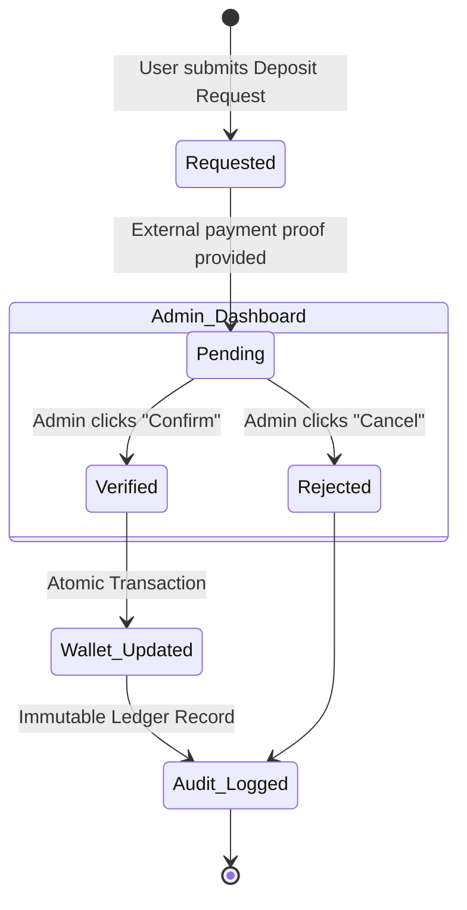

# Financial Transaction Flow (Deposits)

This document maps the state transitions for financial deposits via the Admin Dashboard.

## Detailed Atomic Steps (Verified State)
When an administrator confirms a deposit, the backend executes a **PostgreSQL Transaction** (ACID compliant) ensuring all or nothing:
1. **Wallet Fetch**: Obtain the user's `cash` wallet ID.
2. **Ledger Entry**: Insert a row into `wallet_transactions` with `type='deposit'` and `status='completed'`.
3. **Balance Update**: Increment the `balance_cents` in the `wallets` table.
4. **Audit Log**: Record the action in `audit_logs` including the actor (Admin ID) and the change vector.

## Integrity Guarantees
- **Integer Arithmetic**: All currency is stored as `bigint` (cents) to avoid floating-point errors.
- **Transactional Consistency**: If the Audit Log fails to write, the Balance Update is rolled back automatically.
- **Reference Integrity**: All transactions are linked to an `external_ref_id` (e.g., Bank Transfer ID) for reconciliation.
