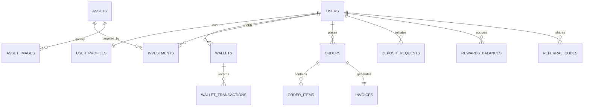

# Database Schema Intelligence & Migrations

This document provides a guided overview of the database migrations and the evolving schema.

## Migration History & Business Context

| Migration | Title | Key Impact | Business Logic |
| :--- | :--- | :--- | :--- |
| `001` | Initial Schema | Users, Profiles, Assets, Wallets | Core platform foundation based on original designs. |
| `002` | Seed Data | Mock data portal | Baseline state for testing and development. |
| `004` | Rewards Schema | Tiers, Referrals, Cashback | Implements Tiered Rewards (Intro to Premium) and 30 USD referral bonus. |
| `005` | Payments & Checkout | Multi-currency, Invoices | Introduces IDR/USD fiat support and atomic invoice generation. |
| `006` | Admin Settings | RBAC, Platform Config | Fine-grained permissions (Compliance, Finance, Support) and global toggles. |

## Core Entities & Relationships



## Schema Guardrails
- **Currency Integrity**: All financial values are stored as `BIGINT` (cents). No floating point numbers allowed in `_cents` columns.
- **Audit Requirement**: Critical changes (User status, Financial adjustments) are logged in `audit_logs`.
- **Atomic Operations**: Invoicing and Order completion MUST occur within a single database transaction.

## Operational Commands
To update the schema documentation or check for drift:
```bash
# Update SQLx offline data (used for documentation & CI)
cd backend && cargo sqlx prepare
```
